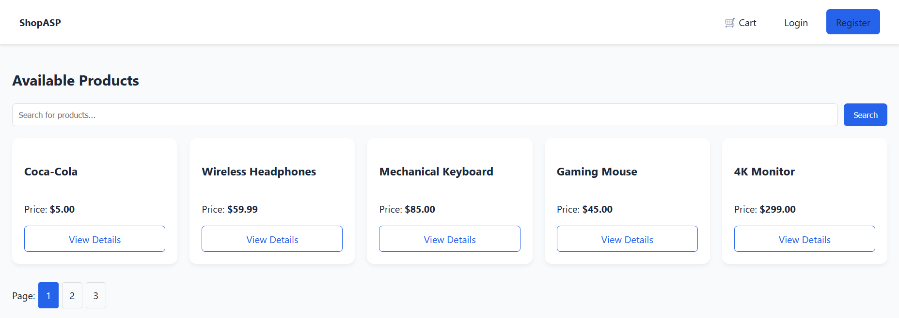

# ShopASP

Online shopping site wirtten in ASP\.NET Core by Wojciech Kieloch as the final assigment for Application Design Course in ASP\.NET 2025/2026 at the University of Wrocław.

## Requirements & Running

Install Visual Studio with net9.0 and run the project.

## Shop's features

Anonymous User (without logging in):

- Browsing the store catalog (products)
- Simple search by product name/description

Registered User:

- Creating a new account (providing login/username and password)
- Ability to log in
- While browsing the catalog – ability to add products to the shopping cart
- Order summary from the shopping cart

Administrator:

- Adding/modifying/deleting products in the store
- Viewing the list of users
- Viewing the list of placed/open orders